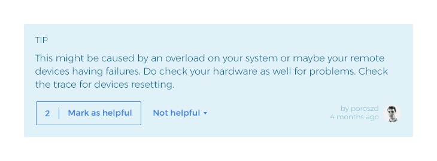
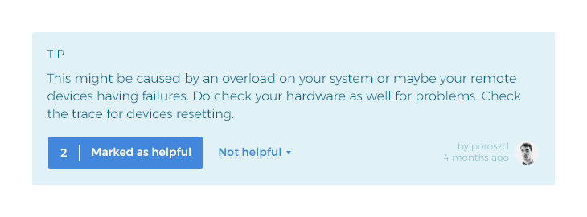

# Rating solutions

The [Samebug search](search/search.md) algorithm uses the semantics of the [stack traces](stack-trace.md) to define similarity.
When it presents the [search results](solution/solutions.md), they are ordered by the similarity of the stack trace
of the solution. However, we do not automatically evaluate the content of the solution, so
we need the Community to rate them in order to make Samebug learn what are the good solutions.

## Mark as helpful

A tip before you mark | A tip after you marked
:-------:|:-----------:
 | 

On the stack trace search result page you can press 'Mark as helpful' button on the solution
that you found worthy. This simple click has multiple effects:
- other Samebug users see the number of marks on each solution, and the more mark it has, the
more likely it contains some useful information
- if the solution was a [tip](write-tip.md) written by a Samebug user, he will [get recognition](profile/profile.md)
for writing helpful tips
- Samebug search algorithm will have more information to weight the value of the solutions
- a new [crash tag](solution/crash-tag.md) will be created combining the stack trace you used for search and the
 content of the solution you marked
